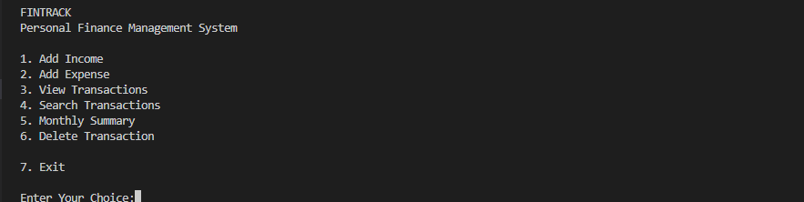
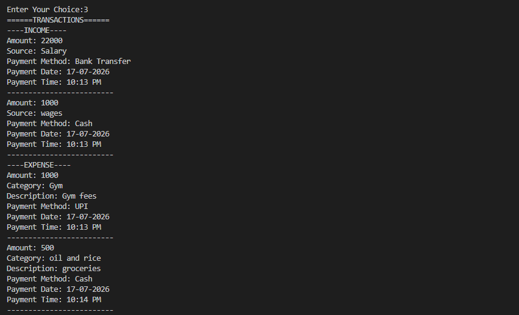

# 💰 FinTrack

A modular command-line Personal Finance Management System built with Python.

FinTrack enables users to manage their personal finances by recording income and expenses, searching transactions, viewing monthly summaries, deleting expense records, and securely storing data using JSON. The project follows a modular architecture, making it clean, maintainable, and easy to extend with future features.

---

## 📷 Preview

### Main Menu



### Transactions



---

## ✨ Features

- ➕ Add income transactions
- ➖ Add expense transactions
- 📋 View all income and expense records
- 🔍 Search expense transactions by:
  - Category
  - Description
  - Payment Method
- 📊 View monthly financial summary
- 🗑️ Delete expense transactions
- 💾 Automatic JSON data storage
- 📅 Automatic date and time recording
- ✅ Input validation for a better user experience

---

## 🛠️ Technologies Used

- Python 3
- JSON
- Python Standard Library (`json`, `datetime`)
- Git
- GitHub

---

## 🏗️ Project Architecture

The project follows a modular design where each module has a single responsibility.

```text
main.py
│
├── validation.py     → Input validation
├── payment.py        → Payment method selection
├── income.py         → Income management
├── expense.py        → Expense management
├── transactions.py   → View, search & delete transactions
├── summary.py        → Monthly financial summary
└── storage.py        → JSON file operations
```

## 📁 Project Structure

```text
FinTrack/
│
├── src/
│   ├── main.py
│   ├── income.py
│   ├── expense.py
│   ├── transactions.py
│   ├── summary.py
│   ├── storage.py
│   ├── payment.py
│   └── validation.py
│
├── docs/
├── data.json
├── requirements.txt
├── README.md
├── LICENSE
└── .gitignore
```

---

## ▶️ How to Run

### 1. Clone the repository

```bash
git clone https://github.com/Md-Yousuf-Khan-06/FinTrack.git
```

### 2. Navigate to the project folder

```bash
cd FinTrack
```

### 3. (Optional) Create and activate a virtual environment

**Windows**

```bash
python -m venv .venv
.venv\Scripts\activate
```

### 4. Run the application

```bash
python src/main.py
```

---

## 📋 Sample Menu

```text
FINTRACK
Personal Finance Management System

1. Add Income
2. Add Expense
3. View Transactions
4. Search Transactions
5. Monthly Summary
6. Delete Transaction
7. Exit
```

---

## 🚀 Future Improvements

- Edit existing income and expense transactions
- Search income transactions
- Category-wise expense reports
- Monthly and yearly financial reports
- SQLite database integration
- User authentication
- Dashboard with charts and analytics
- GUI using Tkinter or PyQt
- Web version using Django or Flask

---

## 👨‍💻 Author

**Mohammed Yousuf Khan**

- Python Developer
- AI & Machine Learning Enthusiast

### 🔗 Connect

- **GitHub:** https://github.com/Md-Yousuf-Khan-06
- **LinkedIn:** https://www.linkedin.com/in/mohammed-yousuf-khan-ai

---

## 📌 Project Status

**Version:** 2.0

✅ FinTrack V2 is complete.

### Current Features

- Modular Python architecture
- Income management
- Expense management
- Transaction search
- Monthly financial summary
- Delete expense transactions
- Automatic JSON data storage
- Automatic date and time recording
- Input validation

---

## ⭐ If you found this project useful

Feel free to star the repository and explore the code.

Contributions, suggestions, and feedback are always welcome.